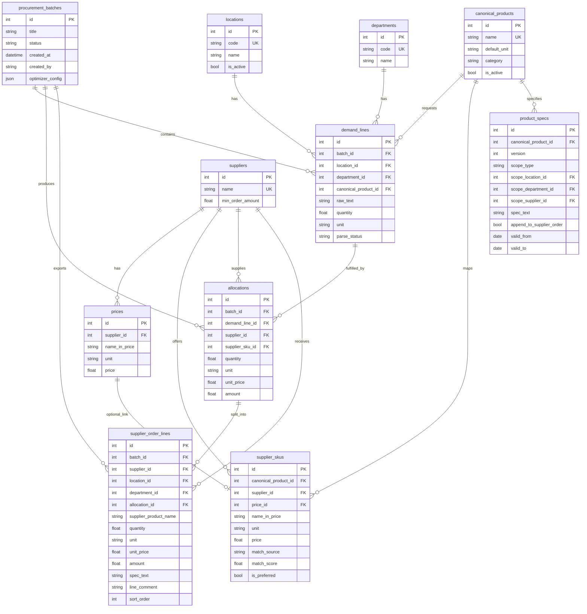

# Вариант B: схема БД и экраны

Документ для развития tutuorders: 4 локации, кухня/бар, глобальная оптимизация закупки, отдельные списки поставщикам по локациям, настраиваемые комментарии.

---

## 1. Связь с тем, что уже есть

| Сейчас | В варианте B |
|--------|----------------|
| `suppliers` | без изменений по смыслу |
| `prices` | сырой прайс поставщика (как сейчас) |
| текстовый заказ → parse → match | → `procurement_batches` + `demand_lines` |
| комментарий в результате (runtime) | → `product_specs` + сборка в `supplier_order_lines` |
| один список результата | глобальный план + экспорт по поставщику × локация × отдел |

---

## 2. ER-диаграмма



---

## 3. Таблицы (SQLite)

### 3.1 Справочники

```sql
CREATE TABLE locations (
  id INTEGER PRIMARY KEY,
  code TEXT NOT NULL UNIQUE,           -- 'loc_1' .. 'loc_4'
  name TEXT NOT NULL,                  -- отображаемое имя
  sort_order INTEGER NOT NULL DEFAULT 0,
  is_active INTEGER NOT NULL DEFAULT 1
);

CREATE TABLE departments (
  id INTEGER PRIMARY KEY,
  code TEXT NOT NULL UNIQUE,           -- 'kitchen' | 'bar'
  name TEXT NOT NULL                   -- 'Кухня' | 'Бар'
);

-- Сиды
INSERT INTO departments (id, code, name) VALUES (1, 'kitchen', 'Кухня'), (2, 'bar', 'Бар');
```

### 3.2 Каталог и прайсы

```sql
CREATE TABLE canonical_products (
  id INTEGER PRIMARY KEY AUTOINCREMENT,
  name TEXT NOT NULL UNIQUE,           -- 'Клубника', 'Лук шалот'
  default_unit TEXT NOT NULL DEFAULT 'кг'
    CHECK (default_unit IN ('кг', 'г', 'л', 'мл')),
  category TEXT,                       -- 'овощи', 'ягоды' — для фильтров
  notes TEXT,                          -- внутренняя заметка (не для поставщика)
  is_active INTEGER NOT NULL DEFAULT 1,
  created_at TEXT NOT NULL DEFAULT (datetime('now')),
  updated_at TEXT NOT NULL DEFAULT (datetime('now'))
);

-- Связь канонического продукта с позицией прайса поставщика
CREATE TABLE supplier_skus (
  id INTEGER PRIMARY KEY AUTOINCREMENT,
  canonical_product_id INTEGER NOT NULL REFERENCES canonical_products(id) ON DELETE CASCADE,
  supplier_id INTEGER NOT NULL REFERENCES suppliers(id) ON DELETE CASCADE,
  price_id INTEGER REFERENCES prices(id) ON DELETE SET NULL,
  name_in_price TEXT NOT NULL,         -- как в прайсе / в заказе поставщику
  unit TEXT NOT NULL CHECK (unit IN ('кг', 'г', 'л', 'мл')),
  price REAL NOT NULL CHECK (price > 0),
  match_source TEXT NOT NULL DEFAULT 'manual'
    CHECK (match_source IN ('manual', 'ai', 'rule', 'import')),
  match_score REAL,                    -- 0..1 для ai/rule
  is_preferred INTEGER NOT NULL DEFAULT 0,  -- приоритет при равной цене
  is_active INTEGER NOT NULL DEFAULT 1,
  UNIQUE (canonical_product_id, supplier_id, name_in_price)
);

CREATE INDEX idx_supplier_skus_lookup ON supplier_skus(canonical_product_id, supplier_id);
CREATE INDEX idx_supplier_skus_supplier ON supplier_skus(supplier_id);
```

**Правило синхронизации:** при загрузке прайса (`prices`) — обновлять `price`/`unit` в `supplier_skus` по `price_id`; новые строки прайса без связи попадают в очередь «предложить матч».

### 3.3 Спецификации (комментарии для поставщика)

```sql
CREATE TABLE product_specs (
  id INTEGER PRIMARY KEY AUTOINCREMENT,
  canonical_product_id INTEGER NOT NULL REFERENCES canonical_products(id) ON DELETE CASCADE,
  version INTEGER NOT NULL DEFAULT 1,
  scope_type TEXT NOT NULL DEFAULT 'global'
    CHECK (scope_type IN (
      'global',              -- для всех
      'department',             -- кухня или бар
      'location',            -- одна локация
      'location_department',    -- локация + отдел
      'supplier',            -- только при заказе у поставщика S
      'supplier_department',    -- поставщик + отдел
      'supplier_location'    -- поставщик + локация
    )),
  scope_location_id INTEGER REFERENCES locations(id) ON DELETE CASCADE,
  scope_department_id INTEGER REFERENCES departments(id) ON DELETE CASCADE,
  scope_supplier_id INTEGER REFERENCES suppliers(id) ON DELETE CASCADE,
  spec_text TEXT NOT NULL,             -- 'калибр 25-30', 'только фиолетовый'
  append_to_supplier_order INTEGER NOT NULL DEFAULT 1,
  valid_from TEXT,                     -- NULL = сразу
  valid_to TEXT,                       -- NULL = бессрочно
  is_active INTEGER NOT NULL DEFAULT 1,
  created_at TEXT NOT NULL DEFAULT (datetime('now')),
  created_by TEXT
);

CREATE INDEX idx_product_specs_product ON product_specs(canonical_product_id, is_active);
```

**Приоритет при сборке строки заказа** (от узкого к широкому):

1. `supplier_location`  
2. `supplier_department`  
3. `supplier`  
4. `location_department`  
5. `location`  
6. `department`  
7. `global`  

Активные версии: `is_active=1` и дата в `[valid_from, valid_to]`.

### 3.4 План закупки (пакет / сессия)

```sql
CREATE TABLE procurement_batches (
  id INTEGER PRIMARY KEY AUTOINCREMENT,
  title TEXT NOT NULL,                 -- 'Заказ 12.05.2026'
  status TEXT NOT NULL DEFAULT 'draft'
    CHECK (status IN (
      'draft',           -- ввод спроса
      'parsed',          -- разобрано
      'matched',         -- матчинг готов
      'optimized',       -- распределение по поставщикам
      'approved',        -- проверено человеком
      'exported'         -- выгружено поставщикам
    )),
  optimizer_mode TEXT NOT NULL DEFAULT 'milp'
    CHECK (optimizer_mode IN ('milp', 'greedy_fallback', 'manual')),
  optimizer_config TEXT,               -- JSON: штраф за лишних поставщиков и т.д. (без выбора в UI)
  total_amount REAL,
  created_at TEXT NOT NULL DEFAULT (datetime('now')),
  created_by TEXT,
  approved_at TEXT
);
```

### 3.5 Спрос (по локациям и отделам)

```sql
CREATE TABLE demand_lines (
  id INTEGER PRIMARY KEY AUTOINCREMENT,
  batch_id INTEGER NOT NULL REFERENCES procurement_batches(id) ON DELETE CASCADE,
  location_id INTEGER NOT NULL REFERENCES locations(id),
  department_id INTEGER NOT NULL REFERENCES departments(id),
  canonical_product_id INTEGER REFERENCES canonical_products(id),
  raw_text TEXT NOT NULL,              -- исходная строка
  quantity REAL NOT NULL,
  unit TEXT NOT NULL CHECK (unit IN ('кг', 'г', 'л', 'мл')),
  normalized_quantity REAL,            -- после г→кг, л→мл
  normalized_unit TEXT,
  parse_status TEXT NOT NULL DEFAULT 'ok'
    CHECK (parse_status IN ('ok', 'unparsed', 'needs_product')),
  line_notes TEXT,                     -- разовый комментарий к строке (не spec)
  sort_order INTEGER NOT NULL DEFAULT 0
);

CREATE INDEX idx_demand_lines_batch ON demand_lines(batch_id);
CREATE INDEX idx_demand_lines_group ON demand_lines(batch_id, canonical_product_id);
```

**Ввод:** вставка текста отдельно по `(location, department)` или одна таблица с колонками локация/отдел.

### 3.6 Оптимизация (глобально)

```sql
CREATE TABLE allocations (
  id INTEGER PRIMARY KEY AUTOINCREMENT,
  batch_id INTEGER NOT NULL REFERENCES procurement_batches(id) ON DELETE CASCADE,
  demand_line_id INTEGER NOT NULL REFERENCES demand_lines(id) ON DELETE CASCADE,
  supplier_id INTEGER NOT NULL REFERENCES suppliers(id),
  supplier_sku_id INTEGER NOT NULL REFERENCES supplier_skus(id),
  quantity REAL NOT NULL,
  unit TEXT NOT NULL,
  unit_price REAL NOT NULL,
  amount REAL NOT NULL,
  source TEXT NOT NULL DEFAULT 'optimizer'
    CHECK (source IN ('optimizer', 'manual_override')),
  UNIQUE (demand_line_id)              -- одна строка спроса → ровно один поставщик
);

-- Жёсткое бизнес-правило (проверяется оптимизатором и при сохранении):
-- для одного batch_id и canonical_product_id — один supplier_id на все локации/отделы.
-- Клубника не дробится между поставщиками (накладные).

CREATE TABLE supplier_order_totals (
  batch_id INTEGER NOT NULL,
  supplier_id INTEGER NOT NULL,
  amount REAL NOT NULL,
  min_order_amount REAL NOT NULL,
  min_order_passed INTEGER NOT NULL,
  PRIMARY KEY (batch_id, supplier_id),
  FOREIGN KEY (batch_id) REFERENCES procurement_batches(id) ON DELETE CASCADE,
  FOREIGN KEY (supplier_id) REFERENCES suppliers(id)
);
```

### 3.7 Выход поставщикам (по локациям)

```sql
CREATE TABLE supplier_order_lines (
  id INTEGER PRIMARY KEY AUTOINCREMENT,
  batch_id INTEGER NOT NULL REFERENCES procurement_batches(id) ON DELETE CASCADE,
  supplier_id INTEGER NOT NULL REFERENCES suppliers(id),
  location_id INTEGER NOT NULL REFERENCES locations(id),
  department_id INTEGER NOT NULL REFERENCES departments(id),
  allocation_id INTEGER NOT NULL REFERENCES allocations(id) ON DELETE CASCADE,
  supplier_product_name TEXT NOT NULL,
  quantity REAL NOT NULL,
  unit TEXT NOT NULL,
  unit_price REAL NOT NULL,
  amount REAL NOT NULL,
  spec_text TEXT,                      -- собранные product_specs
  line_comment TEXT,                     -- итоговый комментарий к строке
  sort_order INTEGER NOT NULL DEFAULT 0
);

CREATE INDEX idx_supplier_order_export
  ON supplier_order_lines(batch_id, supplier_id, location_id, department_id);
```

**Сборка `line_comment`:**

```
line_comment = join("\n", [
  spec_text из product_specs (по приоритету scope),
  demand_lines.line_notes (если есть)
])
```

---

## 4. API (черновик)

| Метод | Путь | Назначение |
|-------|------|------------|
| CRUD | `/api/locations` | локации |
| GET | `/api/departments` | кухня/бар |
| CRUD | `/api/products` | canonical_products |
| CRUD | `/api/products/{id}/skus` | supplier_skus |
| CRUD | `/api/products/{id}/specs` | product_specs (+ версии) |
| POST | `/api/products/{id}/skus/suggest` | ИИ/правила: предложить матч по прайсам |
| POST | `/api/procurement/batches` | создать план |
| GET | `/api/procurement/batches/{id}` | статус + сводка |
| POST | `/api/procurement/batches/{id}/demand` | загрузить спрос (location, department, text) |
| POST | `/api/procurement/batches/{id}/parse` | парсинг всех demand_lines |
| POST | `/api/procurement/batches/{id}/match` | матчинг → supplier_sku |
| POST | `/api/procurement/batches/{id}/optimize` | MILP (см. §8); fallback greedy только при ошибке solver |
| PATCH | `/api/procurement/batches/{id}/allocations` | ручная правка |
| POST | `/api/procurement/batches/{id}/build-orders` | supplier_order_lines + specs |
| GET | `/api/procurement/batches/{id}/export` | xlsx: листы по поставщику×локация |
| GET | `/api/procurement/batches/{id}/preview` | превью заказа поставщику |

---

## 5. Экраны (UI)

### Навигация (новая)

```
[Прайсы] [Словарь] [Спецификации] [План закупки] [Настройки]
```

---

### Экран 1 — Прайсы *(доработка текущего)*

**Цель:** поставщики + файлы прайсов.

| Блок | Содержимое |
|------|------------|
| Новый поставщик | как сейчас |
| Карточка поставщика | имя, мин. заказ, загрузка файла, дата, счётчик |
| **Новое:** «Непривязанные позиции» | N строк прайса без `supplier_skus` → кнопка «В словарь» |

---

### Экран 2 — Словарь продуктов

**Цель:** канонические названия и связь с прайсами всех поставщиков.

```
┌─────────────────────────────────────────────────────────────┐
│ Словарь продуктов                    [+ Продукт] [Импорт]  │
├─────────────────────────────────────────────────────────────┤
│ Поиск: [____________]  Категория: [все ▼]  ☐ без матча   │
├──────────┬──────────┬──────────────────────────────────────┤
│ Продукт  │ Ед.      │ Поставщики (SKU)                     │
├──────────┼──────────┼──────────────────────────────────────┤
│ Клубника │ кг       │ С1: Клубника свежая 450₽  [✎][★]    │
│          │          │ С2: Земляника клубника  480₽ [✎]     │
│          │          │ [+ привязать SKU]  [Предложить ИИ]    │
├──────────┼──────────┼──────────────────────────────────────┤
│ Огурцы   │ кг       │ С1: Огурцы тепличные …               │
│          │          │ С2: Cucumbers mini …                  │
└──────────┴──────────┴──────────────────────────────────────┘
```

**Действия:**
- создать/редактировать `canonical_product`;
- привязать строку прайса → `supplier_sku`;
- «Предложить ИИ» — список кандидатов с score, кнопка «Подтвердить» (пишет в БД, `match_source=ai`);
- ★ — `is_preferred` у поставщика для продукта.

**Модалка «Привязать SKU»:** выбор поставщика → поиск по прайсу → сохранить.

---

### Экран 3 — Спецификации

**Цель:** гибко настроить, что дописывается поставщику.

```
┌─────────────────────────────────────────────────────────────┐
│ Спецификации                         Продукт: [Клубника ▼]│
├─────────────────────────────────────────────────────────────┤
│ [+ Добавить правило]                                        │
├────────┬──────────┬────────────┬─────────────────┬──────────┤
│ Область│ Локация  │ Отдел      │ Поставщик       │ Текст    │
├────────┼──────────┼────────────┼─────────────────┼──────────┤
│ Глобально│ —      │ —          │ —               │ калибр…  │
│ Поставщик│ —      │ —          │ Кулинарная…     │ упаковка…│
│ Лок+отдел│ Loc2   │ Бар        │ —               │ …        │
└────────┴──────────┴────────────┴─────────────────┴──────────┘
│ История версий (v3 активна с 01.05.2026)                   │
└─────────────────────────────────────────────────────────────┘
```

**Поля формы:**
- `spec_text` (многострочный);
- `scope_type` + селекты локация/отдел/поставщик;
- `valid_from` / `valid_to`;
- превью: «Как увидит поставщик X строку по клубнике».

---

### Экран 4 — План закупки (главный новый поток)

**Шаги (wizard или вкладки):**

#### 4.1 Спрос

```
┌─────────────────────────────────────────────────────────────┐
│ План закупки #12 · черновик          [Сохранить] [Далее →] │
├─────────────────────────────────────────────────────────────┤
│ Локация: [Loc1 ▼]   Отдел: [Кухня ▼]                       │
│ ┌─────────────────────────────────────────────────────────┐ │
│ │ Брокколи 3 кг                                           │ │
│ │ Клубника 2 кг                                           │ │
│ └─────────────────────────────────────────────────────────┘ │
│ [Проверить ввод]                                            │
│                                                             │
│ Сводка: 4 локации × 2 отдела = 8 блоков  (3/8 заполнено)  │
└─────────────────────────────────────────────────────────────┘
```

- переключение локация/отдел;
- таблица всех `demand_lines` с фильтром;
- статусы: ok / needs_product / unparsed.

#### 4.2 Матчинг *(обязательный шаг; позже — можно пропускать, если нет проблем)*

**Зачем:** убедиться, что сырой ввод → канонический продукт → есть цены у поставщиков (SKU), **до** расчёта сумм.

**Не значит:** каждый раз вручную сопоставлять весь список с прайсами. Большинство строк уже зелёные из словаря; пользователь правит жёлтые/красные.

```
┌─────────────────────────────────────────────────────────────┐
│ Матчинг                    [Запустить матчинг] [Далее →]   │
│ Проблемных строк: 3 из 40                                   │
├────┬────────┬──────┬──────────────┬────────────────────────┤
│Loc │ Отдел  │Спрос │ Канон.       │ SKU у поставщиков      │
├────┼────────┼──────┼──────────────┼────────────────────────┤
│ L1 │ Кухня  │Огурцы│ Огурцы       │ ✓ С1, ✓ С2  [изменить]│
│ L2 │ Бар    │…     │ ?            │ ⚠ выбрать продукт      │
└────┴────────┴──────┴──────────────┴────────────────────────┘
```

- подтверждение/смена `canonical_product`;
- проверка, что у каждого поставщика есть `supplier_sku` (привязки из Словаря);
- кнопка «Предложить ИИ» только для проблемных строк (см. §6).

#### 4.3 Распределение по поставщикам (глобальная оптимизация)

**Один метод в продукте (без выбора в настройках):** MILP с жёстким правилом **не дробить продукт**.

```
┌─────────────────────────────────────────────────────────────┐
│ Распределение                         Итого: 124 500 ₽     │
│ [Пересчитать]  [Объяснение решения]                         │
├─────────────────────────────────────────────────────────────┤
│ Поставщик      │ Сумма    │ Мин.заказ │ OK?                 │
│ Кулинарная…    │ 45 200   │ 20 000    │ ✓                   │
│ Домпродукт     │ 79 300   │ 30 000    │ ✓                   │
├─────────────────────────────────────────────────────────────┤
│ Клубника 6 кг (все локации) → только Домпродукт  [сменить] │
│ Огурцы 12 кг                  → только Кулинарная…           │
└─────────────────────────────────────────────────────────────┘
```

**Смысл:** клубника может быть **не у самого дешёвого** за кг, если так дешевле **весь заказ** (мин. заказы, концентрация у меньшего числа поставщиков).

**Запрещено:** «Клубника 4 кг у С1 + 2 кг у С2» — только **один** поставщик на канонический продукт в рамках плана.

**Разрешено:** L1 кухня 2 кг + L2 бар 4 кг клубники → **все 6 кг одному** поставщику; в `supplier_order_lines` потом **разносится по локациям** для накладных.

- ручная смена поставщика по продукту → `allocations.source=manual_override`, пересчёт сумм.

#### 4.4 Заказы поставщикам (превью)

```
┌─────────────────────────────────────────────────────────────┐
│ Заказы поставщикам              [Скачать все xlsx]          │
├─────────────────────────────────────────────────────────────┤
│ Поставщик: [Кулинарная студия ▼]  Локация: [Loc1 ▼]        │
│ Отдел: [Кухня ▼]                                            │
├─────────────────────────────────────────────────────────────┤
│ Название (из прайса) │ Кол-во │ Ед. │ Комментарий          │
│ Клубника свежая      │ 2.000  │ кг  │ калибр 25-30         │
│ Огурцы тепличные     │ 5.000  │ кг  │                      │
├─────────────────────────────────────────────────────────────┤
│ [Редактировать комментарий строки]  [Скачать этот лист]    │
└─────────────────────────────────────────────────────────────┘
```

- именно то, что «уходит поставщику»;
- правка `line_comment` не меняет specs (или «сохранить как новое правило»).

#### 4.5 Сводка *(внутренний обзор для закупщика)*

**Чем отличается от 4.4:**

| | 4.4 Заказы поставщикам | 4.5 Сводка |
|--|------------------------|------------|
| Аудитория | текст «как отправить поставщику» | вы смотрите всю картину |
| Разрез | один поставщик + одна локация + отдел | все поставщики и локации сразу |
| Цель | проверить комментарии, скачать лист | контроль сумм, мин. заказов, кто что везёт |

**Содержимое (аналог текущей вкладки «Результат»):**

- большая таблица: продукт × колонки поставщиков (цена / кол-во / сумма);
- фильтр по локации и отделу;
- строка «Итого», подсветка «не найдено», статус мин. заказа по поставщику;
- **Скачать сводный xlsx** (внутренний, не для отправки поставщику).

4.4 = «что уйдёт наружу»; 4.5 = «правильно ли мы всё посчитали».

---

### Экран 5 — Настройки

| Раздел | Содержимое |
|--------|------------|
| Локации | CRUD 4 точек, code, name, порядок |
| ИИ | folder_id, model (как сейчас) |
| Шаблон экспорта | формат строки заказа, колонки xlsx |

Тип оптимизатора **не выбирается** — зафиксирован в §8.

---

## 7. Excel-экспорт (структура)

**Файл 1 — Сводка (внутренняя):** все локации, оптимизация, суммы.

**Файлы / листы для поставщиков:**

- лист: `{supplier}_{location}_{department}`  
- колонки: `Название | Кол-во | Ед. | Цена | Сумма | Комментарий`  
- шапка: локация, отдел, дата, контакт.

---

## 6. Матчинг и роль ИИ

ИИ **не участвует** в расчёте сумм и выборе поставщика на шаге 4.3 — только математика.

### Цепочка матчинга


| Шаг | Что | Без ИИ | С ИИ |
|-----|-----|--------|------|
| **A** Сырьё → канон | «огурцы», «ОГУРЕЦ свеж» → `Огурцы` | точное совпадение, синонимы в БД, fuzzy | YandexGPT: выбрать из списка `canonical_products` |
| **B** Канон → SKU | `Огурцы` → «Огурцы тепличные» у С1 | таблица `supplier_skus` (экран Словарь) | если нет привязки: ИИ предлагает строку из `prices` поставщика |

**Когда вызывается ИИ в закупке (4.2):**

1. После «Запустить матчинг» — для строк без канона (шаг A).  
2. Для канона без SKU у поставщика (шаг B) — опционально «Предложить ИИ».  
3. Подтверждённое сохраняется в БД → следующий раз шаг A/B без ИИ.

**Экран Словарь:** ИИ для шага B заранее (массовая настройка прайсов), не в день закупки.

**Как сейчас в MVP:** один вызов ИИ на весь заказ (сырьё → прайс). В варианте B это разделяется: словарь + точечный ИИ на 4.2, оптимизация без ИИ.

---

## 8. Оптимизатор — выбранный метод

### Решение

| | |
|--|--|
| **Основной** | **MILP** (Google OR-Tools / PuLP), одна цель — минимум общей суммы закупки |
| **Запасной** | Greedy «у кого дешевле за позицию» — только если MILP не нашёл решение; показать предупреждение |
| **В UI** | без переключателя; пользователь видит «Пересчитать» и пояснение |

### Жёсткие ограничения

1. **Один поставщик на канонический продукт** в рамках `procurement_batch` (все локации/отделы):  
   \(\sum_s y_{p,s} = 1\) для каждого продукта \(p\).
2. **Не дробить продукт** между поставщиками (клубника целиком одному).
3. **Мин. заказ:** если поставщик \(s\) используется, \(\sum_p cost_{p,s} \geq min\_order_s\).
4. Назначать только пары \((p,s)\), для которых есть активный `supplier_sku`.

### Переменные (упрощённо)

- \(y_{p,s} \in \{0,1\}\) — продукт \(p\) закупаем у поставщика \(s\);
- \(z_s \in \{0,1\}\) — поставщик \(s\) в заказе;
- связь: \(z_s \geq y_{p,s}\);
- стоимость продукта \(p\) у \(s\): \(price_{p,s} \times Q_p\), где \(Q_p\) — суммарное кол-во по всем `demand_lines` с этим каноном.

### Мягкие (в `optimizer_config`, не в UI)

- штраф за каждого лишнего поставщика (меньше накладных);
- штраф за отклонение от `is_preferred`.

### После решения MILP

1. Записать `allocations` — каждая `demand_line` получает того же `supplier_id`, что выбран для её `canonical_product_id`.  
2. Количество в строке — из спроса локации; цена — из `supplier_sku`.  
3. Собрать `supplier_order_lines` для 4.4 (разрез по локациям).

### Greedy «как сейчас» — только fallback

По каждому продукту — минимальная цена; **не гарантирует** мин. заказы и глобальный оптимум. Используется, если MILP infeasible, с явной пометкой на экране.

---

## 9. Этапы внедрения в код

| Этап | Таблицы / экраны | Срок ориентир |
|------|------------------|---------------|
| 1 | `locations`, `departments`, CRUD настройки | 1 нед |
| 2 | `canonical_products`, `supplier_skus`, экран Словарь | 1–2 нед |
| 3 | `product_specs`, экран Спецификации | 1 нед |
| 4 | `procurement_batches`, `demand_lines`, wizard спрос | 1–2 нед |
| 5 | MILP-оптимизатор + экран 4.3 (greedy fallback) | 2 нед |
| 6 | `supplier_order_lines`, экраны 4.4–4.5, экспорт | 1–2 нед |
| 7 | история версий specs, пропуск 4.2 при 0 проблем | позже |

---

## 10. Миграция с текущего MVP

1. Существующие `prices` не трогать.  
2. Опционально: автосоздать `canonical_products` из уникальных строк заказов (ручная чистка).  
3. Текущий flow «Заказ → Сопоставить → Результат» → вкладка **«Быстрый заказ»** внутри «План закупки» (одна локация, один отдел) для обратной совместимости.
